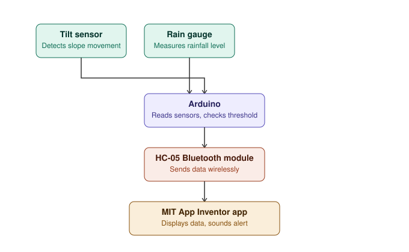

# Landslide / Disaster Early Warning Monitoring System

A real-time landslide early warning system built around an Arduino, a tilt
sensor, and a rain gauge. Sensor readings are sent over Bluetooth (HC-05) to
a companion smartphone app (built with MIT App Inventor) that displays live
status and raises an alert when risk thresholds are crossed.

## Overview

| | |
|---|---|
| Microcontroller | Arduino Uno / Nano |
| Sensors | Digital tilt sensor, analog rain gauge |
| Communication | HC-05 / HC-06 Bluetooth module |
| App | MIT App Inventor (Android) |
| Alerting | In-app sound + popup notification |

## System architecture



Sensors feed the Arduino, which packages the readings and pushes them over
the HC-05 module to the phone app, which displays live status and fires an
alert when a threshold is crossed.

## Circuit diagram


### Pin connections

| Component | Pin | Arduino pin |
|---|---|---|
| Tilt sensor | Signal | D2 |
| Rain sensor | Signal (analog) | A0 |
| HC-05/06 | TXD | D10 (SoftwareSerial RX) |
| HC-05/06 | RXD (via voltage divider) | D11 (SoftwareSerial TX) |
| HC-05/06 | VCC | 5V |
| HC-05/06 | GND | GND |

**Important:** the HC-05/06 `RXD` pin is 3.3V logic. Use a simple resistor
voltage divider (e.g. 1kΩ/2kΩ) or a logic-level shifter between Arduino D11
and the module's RXD pin to avoid damaging it.

## Repository structure

```
.
├── firmware/
│   └── landslide_warning.ino     # Arduino sketch
├── docs/
│   ├── block_diagram.svg         # System architecture diagram
│   └── circuit_diagram.svg       # Wiring diagram
├── mit_app_inventor/
│   └── README.md                 # App Inventor components + block logic
├── LICENSE
└── README.md
```

## Getting started

1. **Wire the hardware** as described in the pin table above and shown in
   `docs/circuit_diagram.svg`.
2. **Flash the Arduino**: open `firmware/landslide_warning.ino` in the
   Arduino IDE, select your board/port, and upload.
3. **Build the app**: follow `mit_app_inventor/README.md` to recreate the
   companion app in [MIT App Inventor](https://appinventor.mit.edu), or
   import a pre-built `.aia` if you've added one to this repo.
4. **Pair and test**: pair your phone with the HC-05/06 module, open the app,
   connect, and verify that tilting the sensor or wetting the rain sensor
   triggers the alert.

## Communication protocol

The Arduino sends one line per second over Bluetooth:

```
<tiltState>,<rainValue>
```

e.g. `0,612`. Whenever a threshold is exceeded, it additionally sends a line
containing just `ALERT`, which the app uses to trigger the sound and popup
notification.

## Calibration

Rain sensor thresholds vary by module and site conditions. Adjust
`RAIN_THRESHOLD` in `firmware/landslide_warning.ino` after testing your
specific sensor in dry and wet conditions.

## Future improvements

- Add a GSM/GPRS module for SMS alerts when out of Bluetooth range
- Log readings to an SD card or cloud dashboard for historical analysis
- Add a seismometer channel for ground-vibration detection
- Add battery/solar power management for field deployment

## License

This project is licensed under the MIT License — see [LICENSE](LICENSE).
